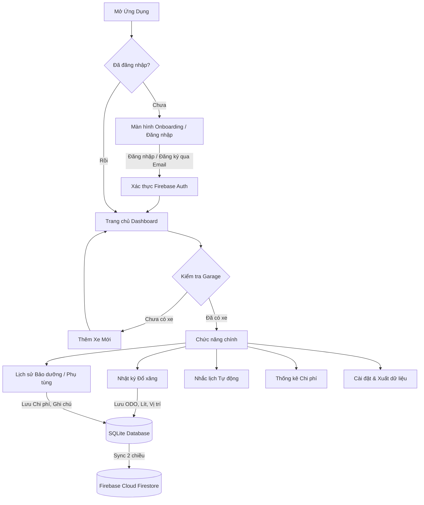
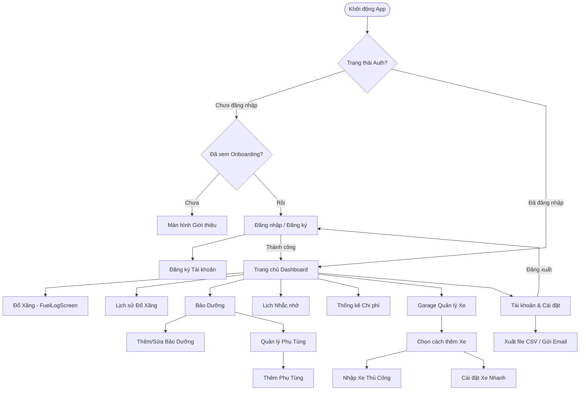
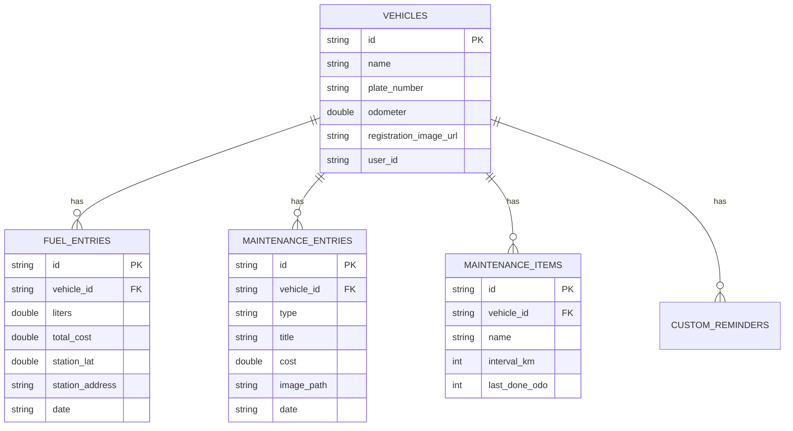
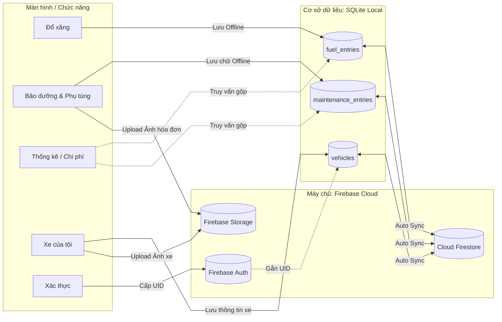

# BÁO CÁO TỔNG KẾT DỰ ÁN: MotoLog - Nhật Ký Phương Tiện Cá Nhân

## 1. Mô tả ý tưởng và Sơ đồ luồng ứng dụng (Workflow)

**Ý tưởng:** 
MotoLog là ứng dụng quản lý toàn diện phương tiện cá nhân. Ứng dụng giải quyết bài toán thực tế: Người dùng thường quên lịch bảo dưỡng định kỳ (thay nhớt, nhông sên dĩa...), không nắm rõ mức tiêu hao nhiên liệu của xe, và hay làm thất lạc hình ảnh các giấy tờ quan trọng (đăng kiểm, bảo hiểm). 
MotoLog giúp số hóa toàn bộ vòng đời của xe thành một "cuốn nhật ký" thu nhỏ ngay trên điện thoại.

**Sơ đồ luồng ứng dụng (Workflow):**

---

## 2. Sơ đồ điều hướng các màn hình (Navigation Flow)

Ứng dụng sử dụng `go_router` để quản lý các tuyến đường (routes). Dưới đây là sơ đồ luồng di chuyển giữa các màn hình chi tiết trong ứng dụng:

---

## 3. Bảng liệt kê các chức năng đã hoàn thành

| STT | Chức năng | Mô tả chi tiết |
| :---: | :--- | :--- |
| 1 | **Quản lý Garage Xe** | Thêm, sửa, xóa xe. Hỗ trợ nhiều xe cùng lúc. Chụp và lưu trữ hình ảnh Đăng ký xe, Đăng kiểm, Bảo hiểm lên Cloud. |
| 2 | **Nhật ký Đổ xăng** | Ghi nhận số km (ODO), số Lít, giá tiền. Tự động tính toán mức tiêu hao (L/100km). Tự động lấy tọa độ hiện tại ra địa chỉ cây xăng. |
| 3 | **Quản lý Bảo dưỡng** | Ghi chép lịch sử thay thế phụ tùng, sửa chữa, rửa xe. Lưu hình ảnh hóa đơn/phụ tùng (Trước - Sau khi thay). |
| 4 | **Nhắc lịch Thông minh** | Theo dõi ODO hiện tại và cài đặt mốc nhắc nhở (VD: thay nhớt mỗi 2000km). Đẩy thông báo (Push Notification) khi sắp đến hạn. |
| 5 | **Thống kê Biểu đồ** | Trực quan hóa chi phí xăng và bảo dưỡng qua biểu đồ dạng cột/tròn theo từng tháng/năm. |
| 6 | **Đồng bộ Đám mây** | Dữ liệu lưu Offline ưu tiên (tốc độ cao). Khi có mạng tự động Push lên Firebase để backup và đồng bộ chéo thiết bị. |
| 7 | **Xuất dữ liệu** | Gom toàn bộ dữ liệu lịch sử thành file `.CSV` (Excel) đính kèm vào Email gửi ra ngoài để báo cáo. |

---

## 4. Mô hình CSDL (Database Schema)

Ứng dụng sử dụng **SQLite** làm cơ sở dữ liệu chính (Local Truth), gồm 5 bảng (Table) có quan hệ chặt chẽ với nhau thông qua `vehicle_id`.

### Sơ đồ Luồng Dữ liệu Đồng bộ (Data Flow)

Dưới đây là sơ đồ kiến trúc luồng dữ liệu chuẩn xác nhất đang được triển khai trong ứng dụng, thể hiện rõ quá trình thao tác từ Màn hình (UI) -> SQLite (Local) -> Firebase Cloud.

---

## 5. Mô tả cơ bản kỹ thuật nâng cao đã tự nghiên cứu

Để ứng dụng đạt tiêu chuẩn thương mại thực tế, các kỹ thuật nâng cao (vượt ngoài giáo trình cơ bản) sau đây đã được áp dụng:

1. **Hệ sinh thái Firebase (Firebase Ecosystem)**
   - **Authentication:** Tích hợp xác thực người dùng an toàn.
   - **Cloud Firestore:** Áp dụng cơ chế lưu trữ phân tán, tạo hàm tự động Sync dữ liệu từ SQLite lên Server giúp backup phòng ngừa rủi ro mất điện thoại.
   - **Firebase Storage:** Tích hợp luồng upload và nén hình ảnh giấy tờ xe từ thiết bị lên bộ nhớ Cloud và lấy link URL hiển thị lại bằng `CachedNetworkImage`.

2. **Dịch vụ Định vị Vị trí (Location-based Services)**
   - Sử dụng thư viện `geolocator` kết hợp với gọi **REST API** (`Nominatim OpenStreetMap`) thông qua package `http`. Khi người dùng thêm lần đổ xăng, hệ thống sẽ dò tọa độ GPS và tự động điền địa chỉ cây xăng (Reverse Geocoding).

3. **Quản lý Trạng thái Nâng cao (Riverpod State Management)**
   - Thay thế hoàn toàn `StatefulWidget` cơ bản và `Provider` cũ kỹ bằng `flutter_riverpod`. Giúp tách biệt hoàn toàn Logic khỏi UI, truyền dữ liệu xuyên suốt app không cần tham số, và xử lý bất đồng bộ (AsyncNotifier) cực kỳ mạnh mẽ.

4. **Trải nghiệm Người dùng (High-end UX/UI)**
   - Sử dụng `CustomScrollView` và Slivers (SliverToBoxAdapter) ở trang chủ tạo độ mượt.
   - Thêm các hoạt ảnh JSON (`Lottie`) vào màn hình Loading và Đăng nhập.
   - Tương tác Native: Dùng `image_picker` mở Camera, `flutter_local_notifications` đẩy thông báo, và `flutter_email_sender` gọi app Mail của hệ điều hành.
